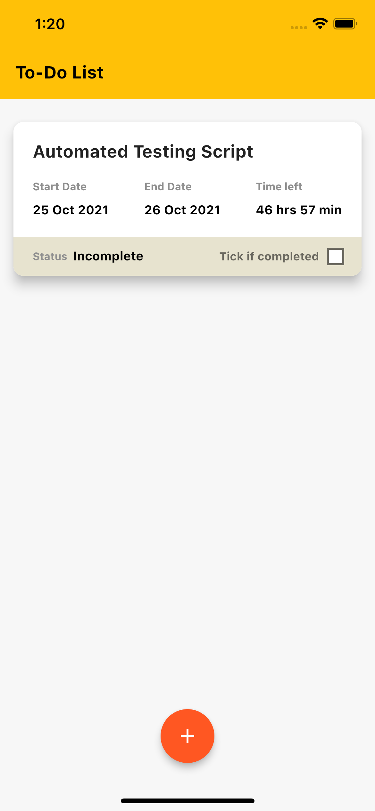
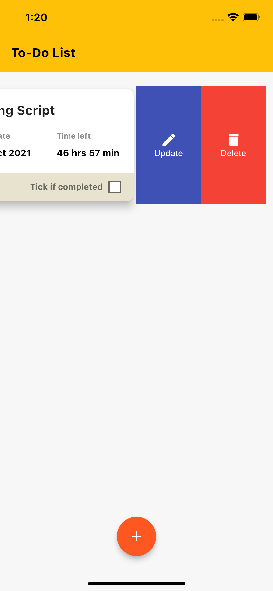
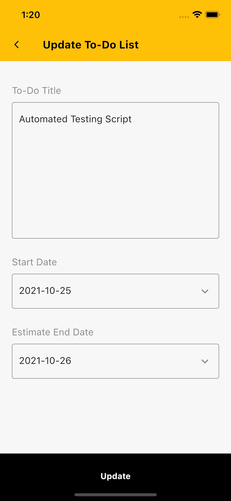
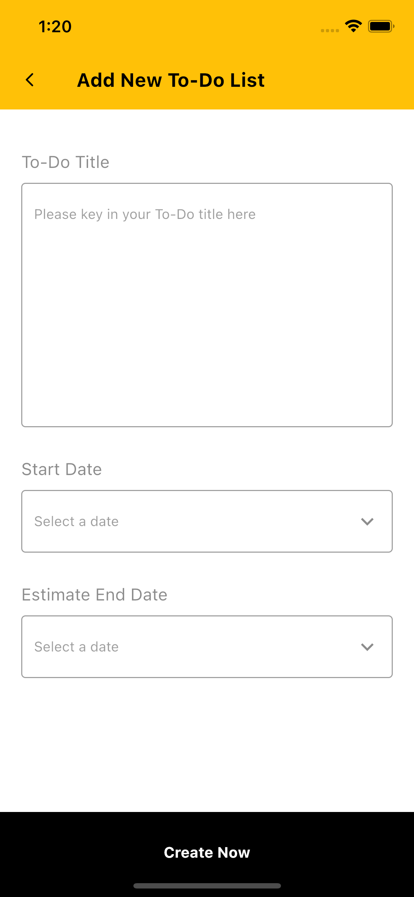
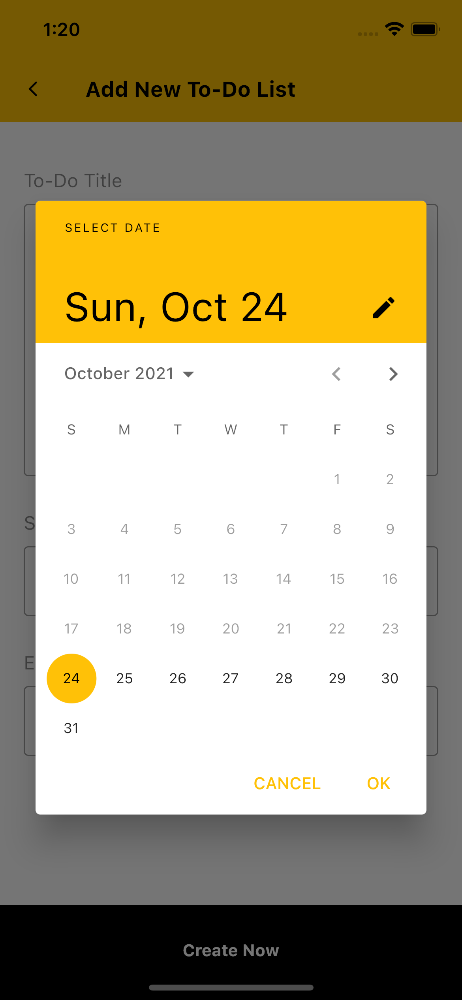

<a href="https://stackoverflow.com/questions/tagged/flutter?sort=votes">
   
</a>

<h1 align="center">
  TODO App (Developer Assessment)
  <br>
</h1>

<h4 align="center">A TODO mobile app develop using <a href="https://flutter.dev" target="_blank">Flutter</a>.</h4>

<p align="center">
  <a href="#key-features">Key Features</a> •
  <a href="#how-to-use">How To Use</a> •
</p>

<p float="left">
  
   
  
  
  
</p>

## Key Features

* Insert, update and remove tasks
* Set start time and end time for the tasks
* Use of Sqflite for data persistence and can store locally


## How To Use

To clone and run this application, you'll need [Git](https://git-scm.com) and [Flutter](https://flutter.dev/docs/get-started/install) installed on your computer. From your command line:

```bash
# Clone this repository
$ git clone https://github.com/wanadzmi/todo.git

# Go into the repository
$ cd todo

# Install dependencies
$ flutter packages get

# Run the app
$ flutter run
```


## License

MIT

---

> GitHub [@wanadzmi](https://github.com/wanadzmi/) &nbsp;&middot;&nbsp;
> Instagram [@wmnws_](https://www.instagram.com/)
> Website (https://www.nadzmi.com/)


